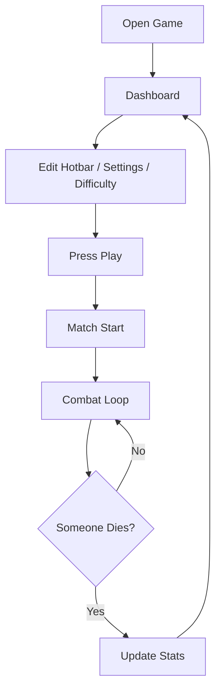

## 1. Product Overview
WindStrike Arena is a browser-based 2D PvP duel game inspired by Minecraft mace combat: high-speed movement, chaotic aerial drops, shield mind-games, and combo-heavy burst damage in a flat arena against a high-difficulty bot.

## 2. Core Features

### 2.1 User Roles
Single player only (player vs bot). No accounts.

### 2.2 Feature Module
1. **Dashboard**: play/start flow, loadout/hotbar editor, settings, difficulty selection, tutorial/controls, stats/wins, fullscreen toggle
2. **Match (Arena)**: 2D combat, physics movement, hotbar usage, items, bot AI, hit feedback, sounds/music, end-of-match return to dashboard

### 2.3 Page Details
| Page Name | Module Name | Feature description |
|-----------|-------------|---------------------|
| Dashboard | Play panel | Play button; quick summary of selected loadout and difficulty; starts a match |
| Dashboard | Loadout editor | Hotbar-only 1–9 slots; drag/reorder; reset to default; shows item counts; saves to local storage |
| Dashboard | Difficulty | 3 presets (Easy/Normal/Hard) controlling bot reaction time, aggression, item usage frequency, and combo probability |
| Dashboard | Settings | Volume sliders (SFX/music), screen shake toggle, hit numbers toggle, particles toggle |
| Dashboard | Controls | Minecraft-like binds reference; shows current binds (WASD, Space, LMB/RMB, 1–9, Shift) |
| Dashboard | Stats | Wins / losses / best streak; stored locally |
| Dashboard | Tutorial/Help | Short, skimmable explanation of mechanics (mace fall scaling, shield disable, wind charge launch, pearls) |
| Dashboard | Fullscreen | Fullscreen toggle using browser fullscreen API |
| Match | Arena core | Flat 2D ground, soft boundaries, simple background parallax; instant return to dashboard on death |
| Match | Movement | Fast accel/decel; sprint; dash with cooldown; double jump; slightly heavy gravity; short coyote time; hit-stun micro-pauses |
| Match | Weapons | Mace (fall-based damage scaling + strong knockback), Axe (can disable shields), Shield (front block with durability and disable) |
| Match | Items | Golden apples (eat delay + heal + temporary absorption), wind charges (ground-target launch), ender pearls (projectile + instant teleport) |
| Match | Combat feel | Combo counter window; crit timing window; damage indicators; screen shake on strong mace hits |
| Match | Bot AI | Reactive defense + aggressive combos; uses shield, axe breaks, wind charge launches, pearl repositions, aerial mace drops |
| Match | Effects & audio | Hit particles, block sparks/cracks, item whooshes; Minecraft-like hit/block/break sounds; background music loop |

## 3. Core Process
Player configures loadout/difficulty on dashboard, starts match, fights bot, and on death returns to dashboard with stats updated.

## 4. User Interface Design
### 4.1 Design Style
- Visual direction: “Obsidian Arena Console” — dark stone UI panels, sharp emerald/red accents, pixel art icons, chunky borders, and punchy screen feedback
- Typography: pixel-display font for headings (e.g. Pixelify Sans / Press Start 2P); readable monospace-like font for body copy
- Buttons: blocky, beveled, hover “lift”, press “thunk”; strong selected states for hotbar and difficulty
- Layout: desktop-first; single-screen dashboard with tabbed panels; match HUD minimal and readable
- Icons: pixel-styled item icons (mace, axe, shield, apple, wind charge, pearl), consistent 16px/24px grid

### 4.2 Page Design Overview
| Page Name | Module Name | UI Elements |
|-----------|-------------|-------------|
| Dashboard | Shell | Centered “game console” panel; tabs (Play, Loadout, Settings, Help); subtle animated background (pixel noise + slow parallax) |
| Dashboard | Loadout editor | Hotbar strip 1–9; draggable tiles; item tooltip card; reset + save feedback |
| Dashboard | Difficulty | 3 large toggle cards; description of bot behavior per preset |
| Match | HUD | Player/bot health + absorption; shield durability bar; hotbar 1–9 with active slot; cooldown pips (dash, wind charge, pearl, golden apple) |
| Match | Combat feedback | Floating damage numbers; combo counter badge; crit flash; screen shake on heavy mace hits |

### 4.3 Responsiveness
Desktop-first with scaling down to small screens by:
- Scaling the canvas while keeping HUD readable
- Enlarged touch targets for dashboard buttons (even if gameplay remains keyboard/mouse oriented)
