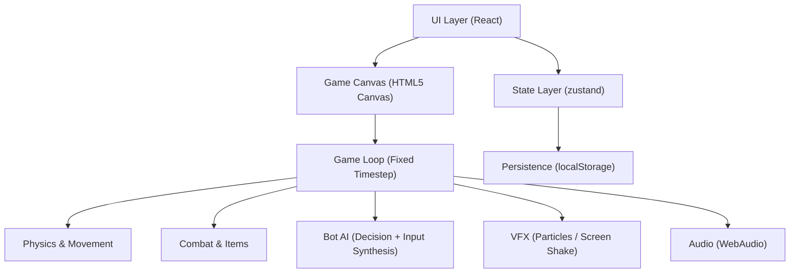

## 1. Architecture Design

## 2. Technology Description
- Frontend: React@18 + TypeScript + Vite + Tailwind CSS + zustand
- Rendering: HTML5 Canvas 2D (pixel-art friendly rendering with integer scaling)
- Audio: WebAudio API (buffer playback; optional synthesized tones for placeholders)
- Backend: None (all local, offline)
- Persistence: localStorage for settings, hotbar order, difficulty, stats

## 3. Route Definitions
| Route | Purpose |
|-------|---------|
| / | Dashboard: play, loadout editor, settings, help, stats |
| /match | Arena: the combat match loop and HUD |

## 4. Runtime Systems (Game Module)

### 4.1 Frame Model
- Fixed timestep simulation (e.g. 60Hz) for deterministic-feeling physics
- Render can interpolate between sim steps for smooth visuals
- Input sampled every frame and applied in sim step to avoid “sticky” controls

### 4.2 Entity Model
Minimal ECS-like composition using plain objects:
- Entity: id, kind, pos/vel, facing, hitbox, state flags
- Player/Bot: stamina/sprint, dash cooldown, jumps remaining, onGround, hurt timers
- Equipment/Inventory: active hotbar slot, item cooldowns, shield durability

### 4.3 Collision
- Arena bounds: ground plane + left/right walls + ceiling clamp
- Entity collision: simple AABB for bodies; separate AABB/segment checks for attacks/projectiles
- Shield block cone: front-facing check using facing direction and relative vector to attacker

### 4.4 Combat
- Mace: base damage + fall-height scaling (track peakHeightSinceGround); impact requires “descending” velocity; high knockback
- Axe: higher shield damage; on hit applies “shield disabled” debuff for a short duration (Minecraft-inspired)
- Shield: RMB hold reduces movement speed; blocks frontal damage and negates knockback; durability decreases on blocked hits; shows crack tiers and breaks into brief disable
- Combo: hit timestamps drive a combo counter window; damage can scale slightly with combo stage
- Critical hits: timing window (e.g. just as descending impact occurs) adds bonus damage/knockback and VFX

### 4.5 Items
- Golden apple: eat channel time; locks attacks; applies heal over time + temporary absorption; cooldown gating
- Wind charge: ground-target cast; applies upward impulse; consumes charge; cooldown; used for aerial setups
- Ender pearl: projectile arc; on landing or contact triggers teleport to impact; applies brief invuln + small self-damage (configurable to match desired feel)

### 4.6 Bot AI
Two-layer design:
- Strategy (low frequency, e.g. 6–10Hz): selects intent (pressure, reset, block, break shield, launch, pearl reposition, go for aerial mace)
- Controller (every sim step): converts intent into synthetic inputs (move left/right, jump, dash, use item, attack, block)
Key behaviors:
- Reads player facing + shield state; swaps to axe to punish shields
- Uses wind charge when player is grounded and within “launch window”
- Uses pearl to escape combos or to close distance if player is kiting
- Attempts aerial mace drops: launches, aligns above player, waits for descent window, strikes

### 4.7 VFX & Feedback
- Particle system: pooled sprites (hit sparks, block shards, crack fragments)
- Screen shake: impulse-based with easing; strongest on mace fall hits
- Damage indicators: floating numbers; optional low-health vignette

### 4.8 Audio
- SFX library: hit, shield block, shield break, wind charge, pearl throw/teleport, eat, dash
- Music: a looping track with volume control; allow mute

## 5. Data Model (Local)

### 5.1 State Types (Conceptual)
- Settings: sfxVolume, musicVolume, screenShakeEnabled, showDamageNumbers, particlesEnabled
- Loadout: hotbarSlots[9] with itemId + count + preferred ordering
- Stats: wins, losses, bestStreak, currentStreak
- DifficultyPreset: reactionMs, aggression, blockRate, comboChance, itemUseRate

### 5.2 Persistence
- localStorage keys are versioned (e.g. windstrike:v1:settings) to allow future migrations without breaking saves
